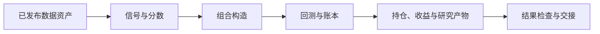

# 平台概览

`quant-platform` 提供可复用的量化研究和组合基础能力。它连接研究信号与组合结果，主要负责组合构造、回测、风险、成本、执行模拟和公开产物契约。

## 一次回测经过什么流程



最小调用路径是：

```text
DataFrame
  → StrategySpec
  → ExecutionModel
  → BacktestSpec
  → run_backtest
  → stats / returns / periods
```

## 各项目负责什么

| 项目 | 主要职责 |
| --- | --- |
| `market-data-platform` | 数据采集、清洗、质量检查、版本和发布 |
| `quant-research` | 策略、特征、模型、实验和研究结论 |
| `quant-platform` | 回测、组合构造、风险、成本、执行模拟和公开契约 |
| `market-intel` | 报告、看板和研究结果交付 |

研究项目通过已发布的数据资产和版本化产物与本仓库协作。平台代码保持策略无关，不保存真实策略输入、凭证或专有选股逻辑。

## 三个核心对象

### `StrategySpec`

描述如何从分数中选择证券和分配目标权重，例如 `top_k`、权重方式、持仓缓冲和分组上限。

### `ExecutionModel`

描述开仓、退出、成本、滑点、交易日历和可交易性约束。

### `BacktestSpec`

把策略、执行模型、调仓日期、持有期和年化口径组合成一个可序列化配置。

## 当前平台不覆盖的内容

- 数据供应商接入和凭证管理
- 私有策略和专有特征
- 模型训练和实验结论
- 券商下单和生产交易运行时

这些职责由调用方或其他项目承担。平台只提供可复用的机制和公开接口。
