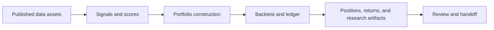

# Platform overview

Language: English · [简体中文](platform-overview.zh-CN.md)

`quant-platform` provides reusable quantitative research and portfolio capabilities. It connects research signals to portfolio results through portfolio construction, backtesting, risk analysis, costs, execution simulation, and public artifact contracts.

## What happens in a backtest


```mermaid
flowchart LR
    Data[Published data assets] --> Signal[Signals and scores]
    Signal --> Portfolio[Portfolio construction]
    Portfolio --> Backtest[Backtest and ledger]
    Backtest --> Results[Positions, returns, and research artifacts]
    Results --> Review[Review and handoff]
```

The minimal call path is:

```text
DataFrame
  → StrategySpec
  → ExecutionModel
  → BacktestSpec
  → run_backtest
  → stats / returns / periods
```

## Project responsibilities

| Project | Responsibility |
| --- | --- |
| `quant-market-data-platform` | Data ingestion, normalization, quality checks, versioning, and publication |
| `quant-research` | Strategies, features, models, experiments, and research conclusions |
| `quant-platform` | Backtesting, portfolio construction, risk, costs, execution simulation, and public contracts |
| `quant-intel-platform` | Reports, dashboards, and research-result delivery |
| `quant-intel-deploy` | Research-result publication and deployment |

Research projects collaborate with this repository through published, versioned data assets and artifacts. The platform remains strategy-agnostic and does not store real strategy inputs, credentials, or proprietary selection logic.

## Three core objects

### `StrategySpec`

Describes how securities are selected from scores and how target weights are assigned. Examples include `top_k`, weighting, holding buffers, and group limits.

### `ExecutionModel`

Describes entry and exit, costs, slippage, trading calendars, and tradability constraints.

### `BacktestSpec`

Combines the strategy, execution model, rebalance dates, holding period, and annualization convention into a serializable configuration.

## Out of scope

- Data-provider integration and credential management
- Private strategies and proprietary features
- Model training and research conclusions
- Broker order placement and production trading runtime

Callers or other projects own these responsibilities. The platform provides reusable mechanisms and public interfaces.
